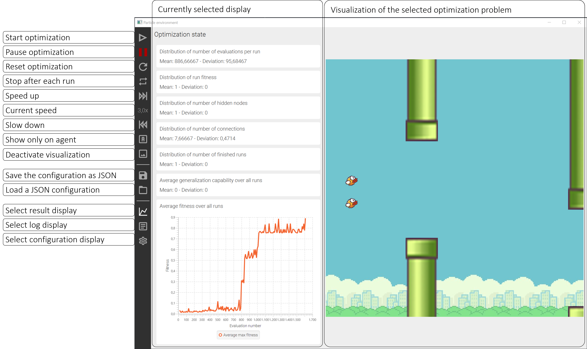

# DANN-ACO

DANN-ACO (Dynamic-artificial-neural-network-ant-colony-optimization) is an algorithm for optimizing the weights and
topology of a neural network similar to [NEAT](https://www.cs.ucf.edu/~kstanley/neat.html). The basis for DANN-ACO
is [ACOR](https://iridia.ulb.ac.be/~mdorigo/HomePageDorigo/thesis/phd/SochaPhDThesis.pdf) developed by Krzysztof Socha.
The main contribution of DANN-ACO is the pheromone-controlled dynamic which enables the growth of the optimized neural
networks. The results achieved by DANN-ACO are comparable to those of neat on simple problems (Cart Pole Balancing,
Flappy Bird, XOR, Pong).

This application isn't just an implementation of DANN-ACO it additionally includes [ANJI](http://anji.sourceforge.net/)
as an implementation of NEAT (Minor changes were made to integrate the library in this application) and several problems
for testing the optimization methods.

This repository contains:

<ul>
  <li>An implementation of DANN-ACO</li>
  <li>An implementation of NEAT by Derek James and Philip Tucker <a href="http://anji.sourceforge.net/">NEAT</a></li>
  <li>The following optimization problems with a variety of adjustable parameters:
    <ul>
      <li>XOR</li>
      <li>Flappy Bird</li>
      <li>Cart pole balancing</li>
      <li>Pong</li>
    </ul>  
  </li>
  <li>Capability for easily adding additional optimization methods and problems</li>
  <li>The following launchers for different use cases:
    <ul>
      <li>Launcher for a parameter optimization with <a href="https://cran.r-project.org/web/packages/irace/index.html">IRACE</a></li>
      <li>GUI with performance plots, a visualization of the problems and forms for configuring the algorithms</li>
      <li>Launcher for comparing different parameter configurations</li>
    </ul>
  </li>
  <li>An neural network implementation</li>
  <li>Several R-Scripts for evaluating the log files produced by the application</li>
  <li>Multiple configurations found by IRACE for DANN-ACO and NEAT</li>
</ul>

## Table of Contents

- [Background](#background)
- [Install](#install)
- [Usage](#usage)
- [Parameters](#parameters)

## Background

The goal of my master thesis was to optimize the weights and topology of a neural network with ant colony optimization (ACO). DANN-ACO is the result of my research. A detailed description of the principles of DANN-ACO can be found in my master thesis (german). A short description of the basic principles is given below.

The functionality of DANN-ACO is basically identical to NEAT. Therefore, the algorithm is capable of adjusting the weights and topology of a neural network. The optimization of the connection weights is similar to the mechanism of ACOR. The only difference is that DANN-ACO has sets of different sizes for each connection, caused by the modifications made to the topology. Consequently, the standard deviation of the distribution which is used to sample new weights depends on the number of values in the solution archive.

The main feature of DANN-ACO is the pheromone-managed dynamic of the topology. This mechanism decides whether a change is made and if so, which modification will be made. Possible structural changes are adding, removing, or splitting connections. A connection split increases the number of hidden neurons by one. The initial topology is minimal (only input and output neurons which are fully connected), and the modifications create an incremental growth of the topology.

DANN-ACO was tested on several reinforcement learning tasks and was able to achieve similar results NEAT. 

## Install

The following software is necessary before running the application:

* [Java](https://adoptium.net/) (at least 16)
* [Maven](https://maven.apache.org/)
* [R](https://www.r-project.org/) (optional only for special evaluations of the results)
* [IRACE](https://cran.r-project.org/web/packages/irace/) (optional only necessary for parameter tuning)

The next step after all prerequisites were are:

1. Cloning this repository
2. Downloading the dependencies with maven `mvn install`
3. Manually add [JavaFX SmartGraph](https://github.com/brunomnsilva/JavaFXSmartGraph) to the local maven repository:
    1. Download the [Zip-files](https://github.com/brunomnsilva/JavaFXSmartGraph)
    2. Extract files from the zip archive and select `JavaFXSmartGraph-0.9.2.jar` from `JavaFXSmartGraph-master/releases`
    3. Add jar to local maven repository by running `mvn install:install-file -Dfile=JavaFXSmartGraph-0.9.2.jar -DgroupId=com.brunomnsilva.smartgraph -DartifactId=smartgraph -Dversion=0.9.2 -Dpackaging=jar`
5. Compile all modules with `mvn clean compile`
4. Start the application  
    A. Start the GUI with `mvn javafx:run` from the folder of the `ParticleEnvironmentLauncher` module  
    B. Create runnable jars for the GUI, IRACE, and CLI with `mvn package` from the folder of the `build_module` (jars can be found afterward in the `target` directory)
   * GUI jar is currently not working because the embedded FXML-files can't be loaded
## Usage

### GUI

The primary interface of the application is the GUI. It offers options for all parameters, shows a variety of data about the current state of the optimization, displays the selected optimization problem and prints log messages. The following image shows a brief overview of the GUI:

The general steps for running an optimization with the GUI are listed below:

1. Load a configuration or define the parameters manually in the configuration display
    * The [configuration directory](configurations) contains several configuration files for different use cases
    * If the parameters are configured manually the defined number of input and output neurons must match the requirements of the currently selected optimization problem. There is currently no validation before the optimization is started and the optimization must be restarted
2. Press the start button to start the optimization
    * The optimization can be stopped or aborted (restarted) at any time
    * Use the speed buttons to accelerate the optimization. The fastest way is to disable the visual output or use the cli 
    * By activating "stop after each run" the optimization stops automatically after each run and must be started again to resume with the next run
3. The current state is shown in the result display, and the results are automatically persisted in a text file in the temp directory
    * After the optimization is finished it must be reset to start the next one
    * The configuration can be saved in JSON-format
    

### CLI

There are two jars that can be used for using the application via the command line. Only `dann_aco_cli.jar` should be used because `dann_aco_irace.jar` is solely for the parameter tuning with IRACE. 

#### Parameter tuning with IRACE

For tuning the parameters with IRACE it is necessary to install R and the IRACE package. The [tuning directory](tuning) contains all files necessary configurations for tuning the parameters of DANN-ACO and NEAT. For further information about the configuration of IRACE see the corresponding [documentation](https://cran.r-project.org/web/packages/irace/). 

Predefined configurations can be found in the [irace configuration director](configurations/irace). In principle, every JSON configuration can be used. After one or multiple test cases were selected they must be found registered in the irace configuration. IRACE differentiates in train and test instances which can be found under [tuning/aco](tuning/aco) for DANN-ACO and [tuning/neat](tuning/neat) for NEAT. Each line in these files represents one test case that is currently used (`#` marks comments). The line below shows a template for defining a test case:

``<name of the test case> --configFile <JSON configuration file> --maxTime <time limit> <dannaco|neat>``

The name of the test case can be chosen arbitrarily. The configuration file defines the specific test case (basically defines the optimization problem and default values for the optimization algorithm). A time limit can be set after which the optimization is being aborted. The last argument defines the used optimization algorithm and must match the configuration file and the settings in the [IRACE-R-file](tuning/irace.R). Afterward, the R-script can be executed. The results are shown on the command line or can be retrieved from the data frame saved in `tuning/execDir/irace.Rdata` with the [visualize_irace.R script](tuning/visualize_irace.R).

#### Using the command line interface

The usage of the cli is similar to the definition of an IRACE test case and has the following form:

``java -jar dann_aco_cli.jar <general parameters> <dannaco|neat> <algorithm specific parameters>``

A description of the parameters can be found in the [following section](#parameters). Important is that the selected algorithm matches the specific parameters, and the configuration file defined in the general parameters. 

## Parameters
### General

| Parameter | Default value | Description |
|---|---|---|
| --configFile | _**Mandatory**_ | JSON configuration file |
| --maxTime | 0 | Maximal amount of time before the optimization is being aborted (if the value is less or equal 0 there is no time limit) |
| --numberOfRuns | 1 | Number of times the optimization defined in the configuration file is executed |
| --parallel | 1 | Number of parallel runs |
| --seed | 9369319 | Seed for for generating the seeds of the individual runs |

### DANN-ACO specific

The following equations are defined by the DANN-ACO parameters:

* _**Topology Pheromone**_ 
  <-aT>(n/<-k>)^<-bT>+<-cT>  (n... number of ants with the same topology)
* _**Connection Pheromone**_ 
  <-ac>(n/<-k>)^<-bc>+<-cc>  (n... number of ants with the same connection)
* _**Standard deviatioon**_ 
  (<-d>s)/(<-k> - 1)+<-e>z  (s... sum of differences of the weights of this connection, z... penalty for too few weights)
* _**Split probability**_ 
  max((c^<-z>*t^<-eta>)/(<-t>d+1), 0)  (c... connection pheromone of the connection, t... topology pheromone of the topology, d... standard deviation of the connection)

| Parameter | Description | Values |
|---|---|---|
| -k | Size of the population | 0 < -k |
| -o | Number of updates per iteration | 1 < -o <= -k   |
| -m | Number of ants per iteration | i < -m |
| --updateStrategy | Update strategy | "AGE", "FITNESS", "PROBABILITY", "AGE_PROBABILITY", "SIMILARITY", "GROUP_BASED" |
| --elitism | Flag for using elitism  (always keeping the best ant in the population) | "true", "false" |
| --neuronIsolation | Flag for enabling the isolation of neurons  (A neuron is isolated if it has no incoming or outgoing connections) | "true", "false" |
| --reuseSplitKnowledge | Flag for reusing the weights of a split connection | "true", "false" |
| -q | Weight factor for an ant in the population | 0 < -q |
| -aT | Part of topology pheromone calculation | 0 < -aT AND -aT + -cT < 1 |
| -bT | Part of topology pheromone calculation | 0 < -bT |
| -cT | Minimal topology pheromone | 0 < -cT AND -aT + -cT < 1 |
| -ac | Part of connection pheromone calculation | 0 < -ac AND -ac + -cc < 1 |
| -bc | Part of connectionpheromone calculation | 0 < -bc |
| -cc | Minimal connection pheromone | 0 < -cc AND -ac + -cc < 1 |
| -eta | Part of split probability | 0 <= -eta |
| -z | Part of split probability | 0 <= -z |
| -t | Part of split probability | 0 <= -t |
| -d | Part of standard deviation | 0 <= -d |
| -e | Part of standard deviation | 0 <= -e |
| -u | Topology similarity threshold (only useful for the similarity update strategy) | 0 <= -u <= 1 |

### NEAT specific

The neat parameters are defined by ANJI and this application just wraps the configuration. The table below shows this mapping and further information can be found in the [ANJI documentation](http://anji.sourceforge.net/javadoc/params.htm).

| Parameter | ANJI-Parameter |
|---|---|
| -sr | survival.rate |
| -tmt | topology.mutation.classic |
| -k | popul.size |
| -ec | chrom.compat.excess.coeff |
| -dc | chrom.compat.disjoint.coeff |
| -cc | chrom.compat.common.coeff |
| -st | speciation.threshold |
| -e | selector.elitism |
| -ems | selector.elitism.min.specie.size |
| -r | selector.roulette |
| -ac | add.connection.mutation.rate |
| -an | add.neuron.mutation.rate |
| -rc | remove.connection.mutation.rate |
| -rcw | remove.connection.max.weight |
| -rcs | remove.connection.strategy |
| -p | prune.mutation.rate |
| -w | weight.mutation.rate |
| -wd | weight.mutation.std.dev |

## License

This project is licensed under the MIT License - see the LICENSE file for details. All derivative work should include this [license](LICENSE).